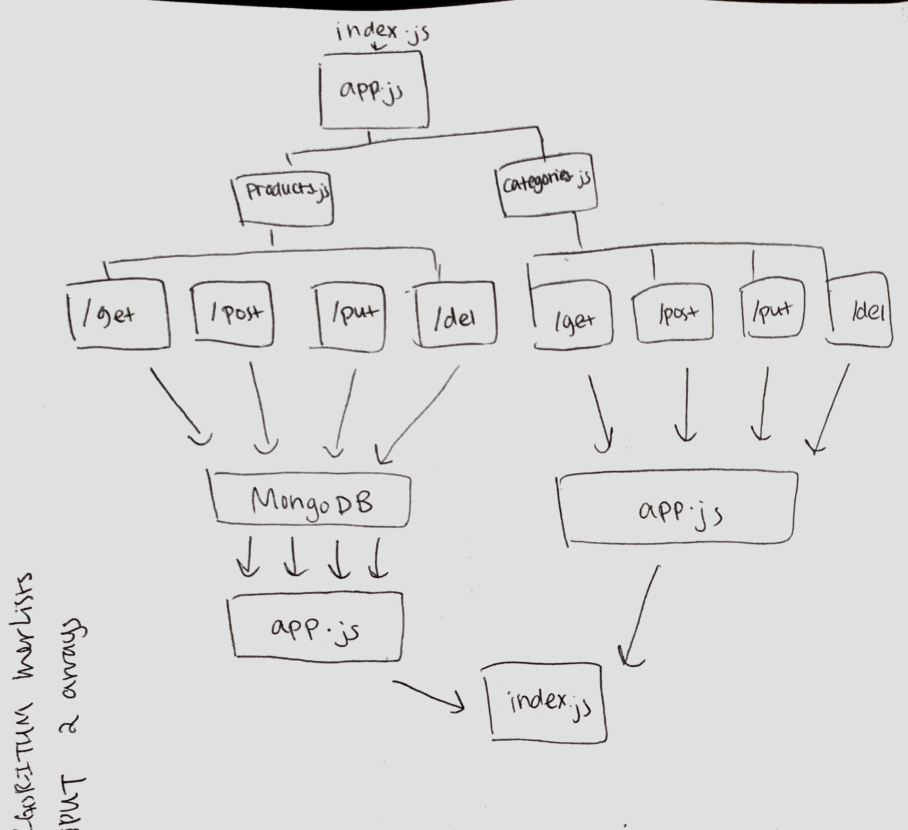

#  LAB

## lab-08-data-modeling

### Author: Bonnie Wang

### Links and Resources

- [submission PR](http://xyz.com)
- [travis](https://www.travis-ci.com/401-advanced-javascript-bw/lab-08-data-modeling)

### Modules

#### `categories.js`

#### `products.js`

#### `apps.js`

### Setup

#### `.env` requirements

- `PORT 8080` - Port Number
- `MONGODB_URI://localhost:27017/lab-08'` - URL to the running mongo instance/db

#### Running the app

- `npm start`
- `nodemone`
- `mongod --dbpath/[path to db]`

#### Tests

- `npm test`
- can GET, POST, PUT, and DELETE categories and products.

#### UML

